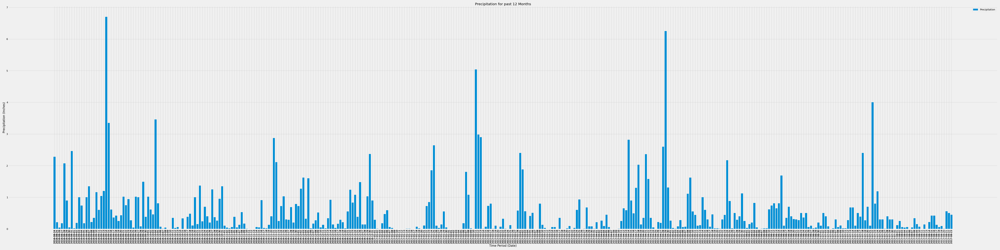

# Climate-Analysis-sqlalchemy-challenge

Challenge is performed using SQLAlchemy, Pandas, matplotlib and datetime on climate analysis and data exploration of the Hawaii Weather data. 

---

## Precipitation Analysis 

Precipitation Analysis was performed on the Precipitation data for date range 2016-08-24 and 2017-08-23

---

## Station Analysis

Station Analysis was performed on the most active station (`USC00519281 - WAIHEE 837.5, HI US`) data for date range 2016-08-24 and 2017-08-23

